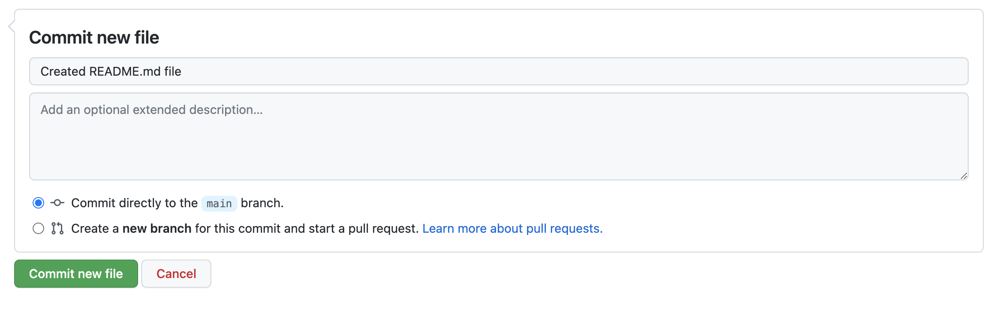

<!-- PROJECT -->
<br />
<h1 align="center">README.md</h3>

<br />

<div align="justify">
    
</div>

  <p align="center">
    <br />
    <a href="https://docs.github.com/en/repositories/managing-your-repositorys-settings-and-features/customizing-your-repository/about-readmes"><strong>Explore documentation »</strong></a>
    <br />
    <a href="https://github.com/stefanicjuraj/README-template/issues">Send Feedback</a>
    ·
    <a href="https://github.com/stefanicjuraj/README-template/issues">Request Features</a>
    ·
    <a href="https://github.com/stefanicjuraj/README-template/issues">Report Bugs</a>
  </p>
  
<br />

<!-- ABOUT PROJECT -->
## About README

<div align="justify">

A README is a text file that contains information for the user about the software, project, code, and/or instructions, help, or details about the packages, version control, patches and updates. A form of documentation, it is usually written in a simple plain text file called `README`, `Read me`, `READ.ME`, `README.TXT`, `README.md` (to indicate the use of markdown), or `README.1ST`. The file's name is generally written in uppercase. On Unix-like systems in particular, this causes it to stand out – both because lowercase filenames are more common, and because the `ls` command commonly sorts and displays files in ASCII-code order, in which uppercase filenames will appear first.


When sharing your code with the world, a problem that might occur is that they may not particularly understand how to use it or even understand it. The README file is used to explain what is uploaded and how we can install or use it. It allows the uploader to add images and videos to help the reader navigate through the project. An unsaid thing about README files is that it even helps your future self.

A README file is usually divided into separate sections which may vary, depending on the scope of the project. It is good practice to always include descriptive sections of the project: `About`, `Technology`, `Installation`, `Usage`, `Examples`, `Resources`, `Credits`, `Contact`,... with the addition of project-specific documentation.
  
    
A README file typically encompasses: 
- Configuration, installing and operating instructions
- A file manifest — list of files in the directory or archive
- Copyright and licensing information
- Contact information for the distributor or author
- Credits, resources and acknowledgements
- Troubleshooting instructions
- Changelog
    
The main focus when writing a README file is it should be brief but also contain all the information needed — it should have clarity and needs to be structured properly. Good practice is to apply the following methods:

- <strong> Up-to-Date </strong>

    Regularly updated to not conflict with what is uploaded to the repository — it should contain details about all the version uploads and mention the changes/ updates to the project.

    
- <strong> Brief & Clear </strong>

    It should only contain what is necessary, written understandably with clear intent.
  
    
- <strong> Detailed </strong>
    
    The README file should not miss out on any information — it should contain all the details necessary to understand what the project is about and how to use it.
    
    > **Example:** 
    > 
    > The user should be informed about pre-defined / customized config files and / or dependencies needed to install and run the project.
    > 

   
- <strong> Self-explanatory </strong>
    
    It should be self-contained — documented in a way to familirize the user with the project as a whole.
    
    > **Example:** 
    > 
    > The user shouldn't have to refer to another new article or documentation to understand what the project is about.
    > 

<br />
</div>

<!-- TECHNOLOGY -->
## Technology

* [![markdown][markdown]][markdown-url]
    * [![html5]][html5]

<div align="justify">
    
A README file uses Markdown — lightweight markup language for creating formatted text using a plain-text editor — a markup language that is appealing to human readers in its source code form. You can add markdown formatting elements to a plain-text file using a text editor. It supports the usage of [HTML tags](https://www.markdownguide.org/basic-syntax#html) in markdown-formatted text.
    
</div>

<!-- INSTALLATION -->
## Installation

<div align="justify">
    
When you create a repository or a project, GitHub gives you the option of a default README. If you were to implement a README file subsequently (after the repository or a project have already been created and instantiated), follow the procedure below:
    
<br />
    
1. <strong> Create the README file via `Add file` > `Create new file` </strong>
<div align="left">

</div>

<br />
    
2. <strong> Input the name of the README file </strong>
```txt
README.md
```
<div align="left">

</div>
    
<br />

3. <strong> Edit and input content for the README file </strong>
<div align="left">

</div>

<br />
    
4. <strong> Commit the newly edited README file </strong>
<div align="left">

</div>

</div>

<!-- Usage -->
## Usage

As mentioned, README files use markup language for creating formatted text using a plain-text editor. It is a good practice to familirize yourself with the syntax and various options before writing a README file:

<a href="https://www.markdownguide.org/basic-syntax"><strong>Markdown cheatsheet »</strong></a>
<div align="left">

</div>

<a href="https://www.markdownguide.org/basic-syntax"><strong>Create your README »</strong></a>

<br />

<!-- Examples -->
## Examples

An example of a README file usage with various singular or combined markdown and HTML tags:
<div align="left">

</div>

<!-- ISSUES -->
## Issues solved by README

- [x] Introduce and familirize a user to the project
- [x] Provide detailed description of the project
- [x] Explain usage and installation
- [x] Preview examples
- [x] Answers 5 Ws
    - [x] Who
    - [x] What
    - [x] When
    - [x] Where
    - [x] Why
    - [ ] How (optional, but prefered)
- [x] View issues or features
- [x] List resources and credits
- [x] Add contact information

[Open issues »](https://github.com/stefanicjuraj/README-template/issues) view a full list of issues.

<!-- RESOURCES -->
## Resources

* [About README](https://docs.github.com/en/repositories/managing-your-repositorys-settings-and-features/customizing-your-repository/about-readmes)
* [Markdown Guide](https://www.markdownguide.org/)
* [Make a README](https://www.makeareadme.com/)

<!-- LICENSE -->
## License

Distributed under the `MIT License`. See `LICENSE.txt` for more information.
    
<!-- CONTACT -->
## Contact

[![linkedin][linkedin]][linkedin-url]

<!-- MARKDOWN LINKS & IMAGES -->
<!-- https://www.markdownguide.org/basic-syntax/#reference-style-links -->
[linkedin]: https://img.shields.io/badge/-LinkedIn-black.svg?style=for-the-badge&logo=linkedin&colorB=555
[linkedin-url]: https://www.linkedin.com/in/jurajstefanic/
[markdown]: https://img.shields.io/badge/markdown-000000?style=for-the-badge&logo=markdown&logoColor=white
[markdown-url]: https://en.wikipedia.org/wiki/Markdown
[markdown-cheatsheet]: ./markdown-cheatsheet.png
[html5]: https://img.shields.io/badge/html-E34F26?style=for-the-badge&logo=HTML5&logoColor=white
